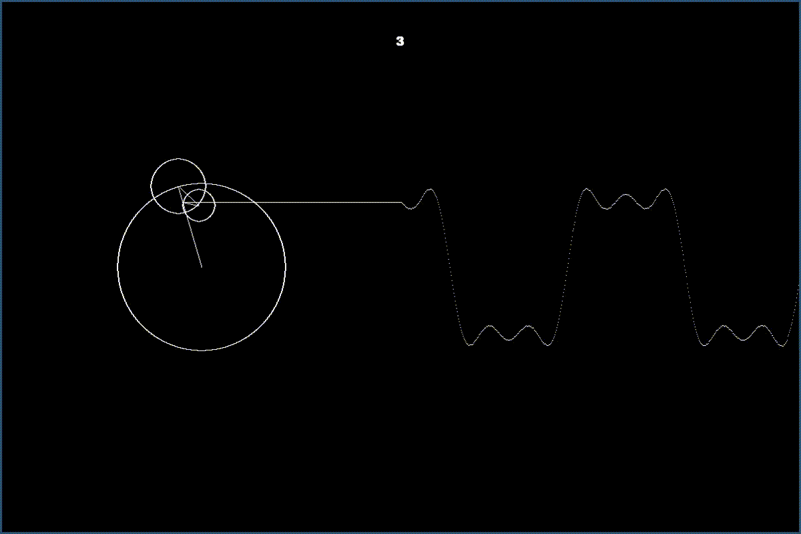

# Fourier's frequency decompositions (Version 0.0.1)



I first saw this representation of a Fourier series from a senior student's
dissertation at Uni in 1995. Through the years it occasionally cropped up. Most
recently was a post from [DineshNG](https://github.com/DineshNG) in
[r/Python](https://reddit.com/r/Python/)

Below is basically a summary of that post. The repo contains my own re-worked
version of the visualization.

# Fourier series and transform resources

3Blue1Brown [has an excellent video on the
topic](https://www.youtube.com/watch?v=spUNpyF58BY) explaining Fourier
transforms visually like this

[This interactive webpage](http://www.jezzamon.com/fourier/) that's very
well-coded and easy to use. You can probably run through the whole page in 15
minutes or less, depending on how much you choose to interact.

Mary Boas' *Mathematical Methods for the Physical Sciences*. A world-class
resource in math "crash courses" if you will, this book will be a lifelong
resource for learning and relearning heavy math topics that you will use for the
rest of your academic life. There's a lengthy section on Fourier Series and one
on Fourier Transforms.

[This lecture series from
Stanford](https://www.youtube.com/playlist?list=PLB24BC7956EE040CD). It's all
about the Fourier Transform, and it's a very inviting course that will leave you
entirely without questions or confusion by the end. By far the best resource on
this list, but it would easily take you weeks to get through the 30 lectures,
each I think 50 minutes long. Also, I believe [this is the set of lecture notes
and practice problems that goes along with this lecture
series](https://see.stanford.edu/materials/lsoftaee261/book-fall-07.pdf). It
would be well worth your time to work with these materials once you've gained a
decent front-end understanding from the first two sources I listed.


# Install

To install pygame on Arch Linux you need to install these dependencies:

```
$ yay -S sdl_image sdl_mixer sdl_ttf portmidi
```

Other systems may have pygame already, the setup below should install all
dependencies.

Now do `pip install -e .` in a virtualenv as usual. Type `fourier` to get the
animation.

You can set a few parameters like these:

```
❯ fourier --help
pygame 1.9.6
Hello from the pygame community. https://www.pygame.org/contribute.html
Usage: fourier [OPTIONS]

Options:
  -t, --terms INTEGER   Number of terms  [default: 3]
  -r, --radius INTEGER  Radius  [default: 100]
  --version             Show the version and exit.
  --help                Show this message and exit.
  
```
